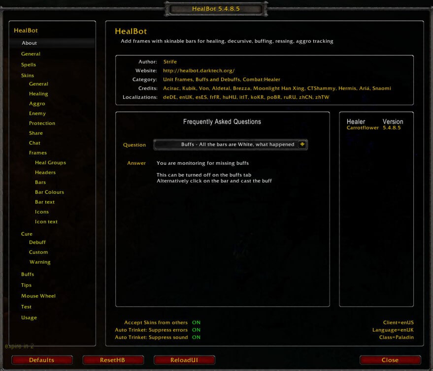
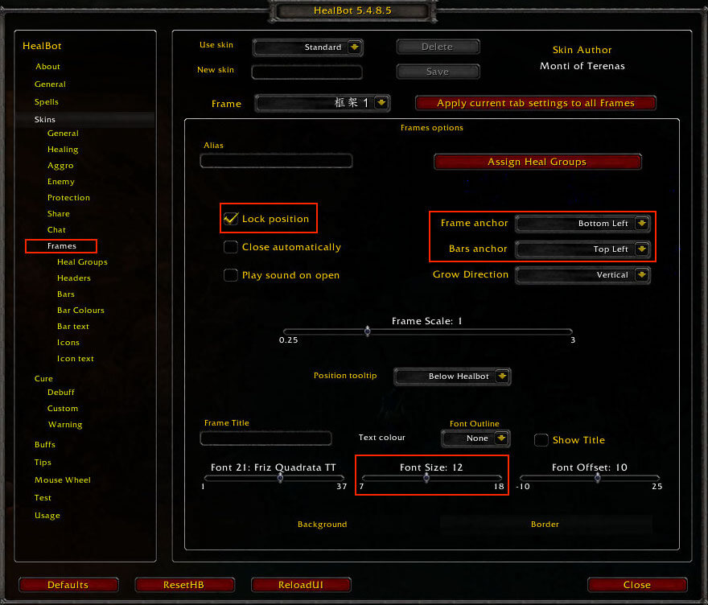
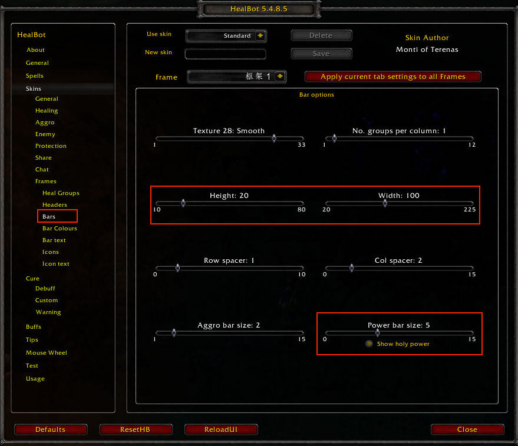
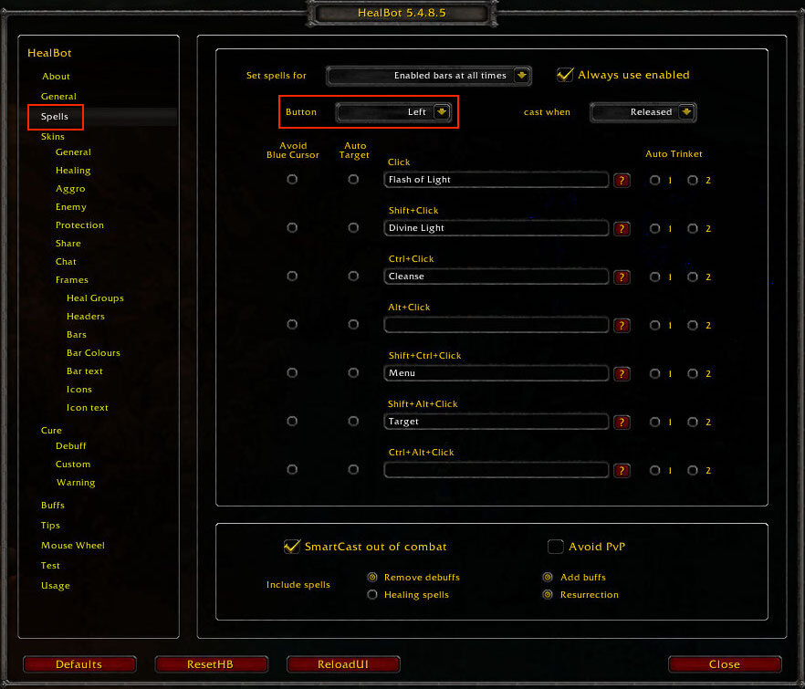
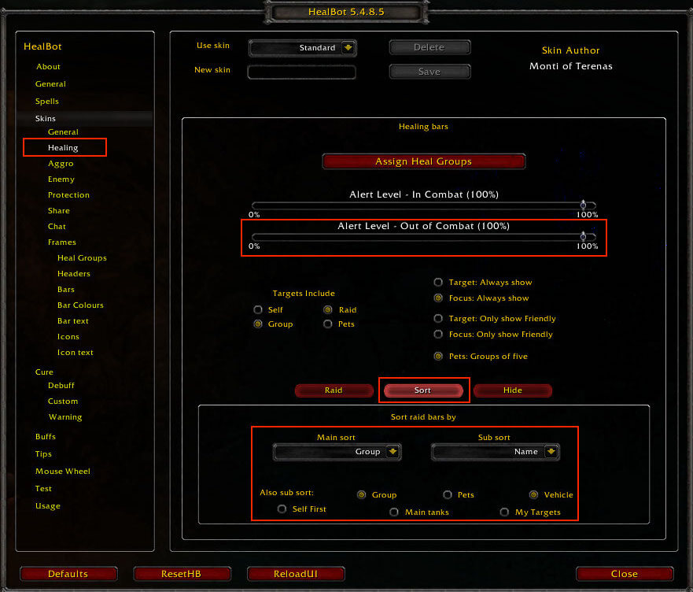

Healbot
==============================================================================
Healbot 是一款团队框架插件, 允许治疗职业点击团队框架上的人直接丢技能治疗. 让治疗变成打地鼠的游戏.

同时它也是多开玩法中非常重要的一环. 只要所有人物的 Healbot 框架的位置顺序一致, 就可以做到在司机界面点击团队框架, 让后台的治疗给特定的人物甩特定的治疗技能的效果.

MOP 5.4.8 版本的 Healbot 插件界面长下面这个样子, 可以通过 ``/healbot`` 命令调出.

为了多开玩法, 你需要做如下设置:

锁定你的 Healbot 框架位置, 避免不同角色的框架位置不一致. 同时你的锚点要选择左下角和左上角, 也就是你的聊天框上面一点点的位置作为参考, 这样能确保整体位置一致.

调整你团队框架方格的宽度和高度, 以适应你的屏幕. 默认是不显示蓝量的, 你可以通过调整 ``Power Bar`` 来调整蓝条高度.

在 Spells 菜单中你可以定义 左键点击, 右键点击, 中键点击, 配合 Shift / Ctrl / Alt 分别有什么效果. 同时还可以设置点击的同时除了施放技能, 还能选中目标

在 Healing 菜单中可以选择如何对人物进行排序, 默认情况下自己永远在最上面, 这是不利于保证所有人的顺序一致的. 你要确保 Main = Group 先按队伍排序, Sub Sort = Name, 同一队的人按名字排列. 然后选择 Also Sub Sort: Group 和 Vehicle, 其他都不选.

